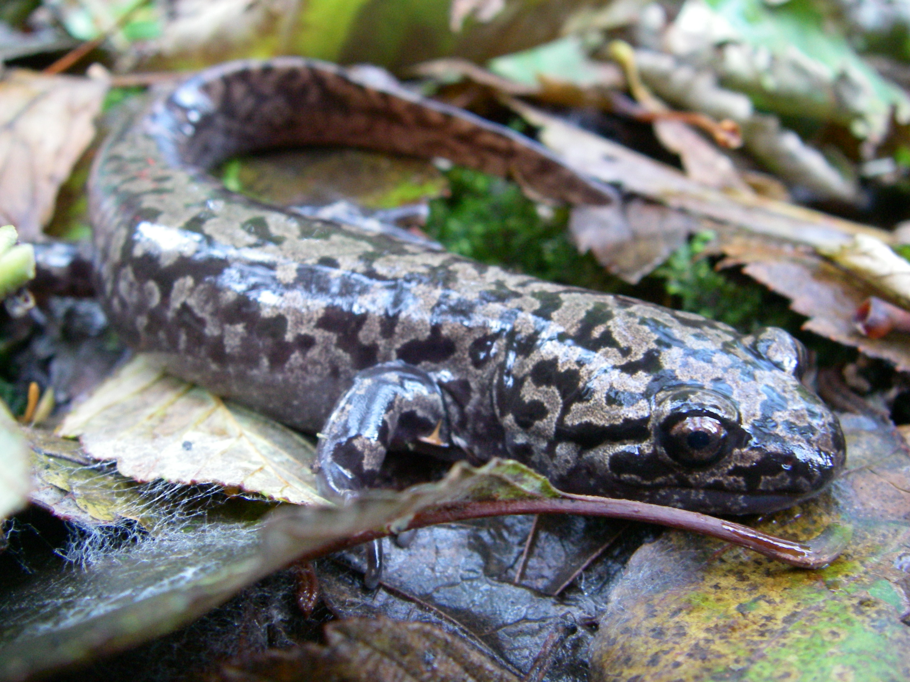
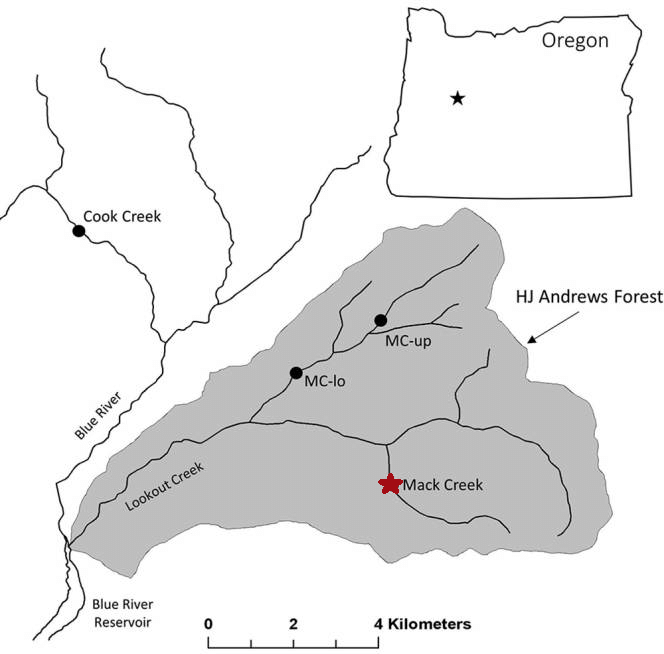

```{r setup, include=FALSE}
knitr::opts_chunk$set(echo = FALSE,
                      message = FALSE,
                      warning = FALSE,
                      results = 'hide')
```

```{r}
# Attach packages

library(tidyverse)
library(janitor)
library(here)
library(kableExtra)
library(ggbeeswarm)
library(car)
library(ggridges)
library(data.table)
library(effsize)

# Read in Mack Creek Vertebrates.csv

mack_creek_df <- read_csv(here::here("raw data", "mack_creek_vertebrates.csv")) %>% 
  clean_names() %>%  # Change column names to lower case
  rename("channeltype" = "unittype") # Rename "unittype" column to "channeltype" for more clarity
```

## Introduction

The Pacific giant salamander, *Dicamptodon tenebrosus*, is native to the Pacific northwest, and at 13 inches in length, it is one of the largest salamanders in North America (OregonWild). Researchers rely on the salamanders to indicate water quality levels, for these amphibians only live in healthy mountain streams. However, habitat loss through logging and other human activities has raised concerns for the continuation of the species (OregonWild). 

Populations of Pacific giant salmanders have been monitored since 1987 (Gregory). A group Oregon State researchers stationed at the HJ Andrews Experimental Forest were already researching the West Slope cutthroat trout, *Onchorhyncus clarki clarki*, at Mack Creek when they decided to include the salamanders in their studies. Each specimen was measured and weighed before release. The number and weight of salamanders were compared between the different areas where they were found, the forest sections (clearcut(CC) and old growth(OG)) and the channel types (channel, pool, and side channel). 


***Figure 1.*** *Pacific giant salamander. Credit: [Jeffrey Marsten](https://en.wikipedia.org/wiki/Pacific_giant_salamander#/media/File:Dicamptodon_tenebrosus_2.JPG)*

## Data and Methods

"Old Growth" refers to the 500 year old coniferous forest upstream, while "Clear Cut" refers to the clear-cut section of the forest.


***Figure 2.*** *Map of Mack Creek within the HJ Andrews Experimental Forest. Identified with a red star. Credit: [Dana Warren-Oregon State](https://www.researchgate.net/figure/Map-of-study-sites-and-the-HJ-Andrews-Experimental-forest-HJA-Each-dot-represents-a_fig1_314206020)*

## Results

```{r}
# Data frame to pull for all results. 
mack_creek_data <- mack_creek_df %>% 
  select(entity, section, channeltype, weight, year)

# Note: Weights is in grams (from metadata)
```

### A. Annual Salamander Counts in Old Growth (OG) and Clear Cut (CC) Sections of Mack Creek


```{r}
# Counting for section (clear and old growth)

mack_creek_cc_og <- mack_creek_data %>% 
  group_by(section, year) %>% 
  summarize(counts = sum(entity)) 

```

The number of giant salamanders did not change much between the two forest sections. Though more salamanders were found in clearcut (n = `r mack_creek_cc_og$counts[1]`) than old growth (n = `r mack_creek_cc_og$counts[32]`) sections in 1987, both soon followed the similar trends of abundance. Salamander counts increased toward 2017, though they seemed to reach their peak for both sections from 2008 to 2012. Then both dipped unil 2015, when populations numbers started rising again into 2017 (CC = `r mack_creek_cc_og$counts[31]`, OG = `r mack_creek_cc_og$counts[62]`).  

```{r}
# Graph for changes in yearly salamander population in these two sections over time 

ggplot(data = mack_creek_cc_og, aes(x = year, y = counts)) +
  geom_line(aes(color = section), size = 1) +
  scale_x_continuous(lim = c(1987, 2017),
                     expand= c(0,0),
                     breaks = seq(0, 2017, 5)) +
  labs(x = "Year", 
       y = "Salamander Counts",
       title = "Yearly giant salmander count from Mack Creek, 1987-2017") + 
  scale_color_manual(name = "Forest Sections",
                     labels = c("Clear Cut",
                                 "Old Growth"),
                     values = c("CC" = "darkolivegreen1",
                                "OG" = "darkgreen")) +
  theme_bw()


ggsave(here::here("figures", "Yearly Salamander Population.png"))

```
*Figure 3. Change in yearly giant salamander abundance between different forest sections(light green: clear cut, dark green: old growth). Both counts increased through the years without many visual differences.*

### B. Salamander Counts by Channel Classification


```{r}
# Clean data subset so that it only includes 2017 observations
mack_creek_weight_2017 <- mack_creek_data %>% 
  filter(year == 2017)


# Determining the counts of salamanders in different channel types in different forest sections for 2017

mack_creek_class_count <- mack_creek_weight_2017 %>% 
  filter(channeltype %in% c("C", "P", "SC")) %>% 
  count(channeltype, section)

# Changing the labels for the channel types. Can't seem to change the row names in the actual table below and can't use pipe operator to combine these steps. 

mack_creek_class_count$channeltype <- gsub("C", "Channel", mack_creek_class_count$channeltype) 

mack_creek_class_count$channeltype <- gsub("P", "Pool", mack_creek_class_count$channeltype)

mack_creek_class_count$channeltype <- gsub("SChannel", "Side Channel", mack_creek_class_count$channeltype)

# Creating a data table from the counts

mack_creek_class_table <- mack_creek_class_count %>% 
  pivot_wider(names_from = section, values_from = n)

```

Just looking populations in the final data collection year, 2017, the proportions of giant salamanders were almost 50% when comparing salamander counts for all channel types across clearcut and original growth sections. This suggests salamanders had almost no preferences between the forest sections, which mirrors the visual results found in Results A. However, there is a large different in salamander counts between the different channel types. There were more giant salamanders in channels (CC = `r mack_creek_class_count$n[1]`, OG = `r mack_creek_class_count$n[2]`) than from the numbers in pools (CC = `r mack_creek_class_count$n[3]`, OG = `r mack_creek_class_count$n[4]`) and side channels (CC = `r mack_creek_class_count$n[5]`, OG = `r mack_creek_class_count$n[6]`) combined. 


*Table 1. The number of giant salamanders found across different parts of the forest. The proportions were calculated and found at almost 50% between CC and OG sections. However, numbers found in channels greatly exceeded those found in pools or side channels.* 
```{r}
# Now finding the proportions

mc_props <- mack_creek_class_table %>% 
  janitor::adorn_percentages(denominator = "row") %>% 
  adorn_pct_formatting(digits = 0) %>% 
  adorn_ns(position = "front")

# Setting up in a kable table 

mc_props <- mc_props %>% 
  rename("Channel type" = channeltype,
         "Clear cut" = CC,
         "Original growth" = OG)

mc_table <- kable(mc_props) %>% 
  kable_styling(bootstrap_options = "striped",
                  full_width = F,
                position = "left") %>% 
  add_header_above(c("Proportion of giant salamaders in different channel types and forest sections" = 3))


mc_table


```
`r mc_table`


### C. Hypothesis Testing: Significant Difference in Location?

```{r}
# Testing the association by chi squared tests

chi_counts <- mack_creek_class_table %>% 
  select(-channeltype)

chi_counts

mack_creek_chi <- chisq.test(chi_counts)

mack_creek_chi
```

Based on the substantial differences in salamander numbers between channel types in clear cut and original growth forest sections, the relationship between them was tested to determine association. There is a significant effect of forest condition (CC/OG) on where in the channel salamanders are found (channel/pool/side-channel) ($\chi$^2^(`r mack_creek_chi$parameter`) = `r round(mack_creek_chi$statistic,2)`, *p* = `r round(mack_creek_chi$p.value, 2)`). The proportions in Table 1 suggest that channel type has stronger effects on salamander locations in forest sections than the other way around. 

### D. Comparison of Salamander Weights in OG and CC Sections

First, we will check the distribution of the data.

```{r}
# Further filter subset so that it only considers creek section for now
mack_creek_weight_section <- mack_creek_weight_2017 %>% 
  select(-channeltype) # Remove channel column

# Create histograms and qq plots to see data distribution

# Faceted histograms

ggplot(data = mack_creek_weight_section, 
       aes(x = weight)) +
  geom_histogram() +
  facet_wrap(~section) # Facet by section

# Faceted QQ plot

ggplot(data = mack_creek_weight_section, 
       aes(sample = weight)) +
  geom_qq() +
  facet_wrap(~section) # Facet by section
```
The histograms show that the data of salamander weights for both sections are positively skewed, and the qq plots are exponentially rising. 

```{r}
# Find mean weight for the two sections
mc_weight_section_summary <- mack_creek_weight_section %>% 
  group_by(section) %>%  # Group by section
  summarize(
    mean_weight = mean(weight, na.rm = TRUE), # Find mean, remove NA values
    sd_weight = sd(weight, na.rm = TRUE), # Find standard deviation, remove NA values
    sample_size = n(), # We don't use count() because data is already grouped by section
    se_weight = sd_weight / sqrt(sample_size), # Find standard error
    var_weight = var(weight, na.rm = TRUE) # Find variance
  ) 
```

However, according to the summary table, the sample sizes are large. We can assume the distribution of mean weight is normal due to the Central Limit Theorem. 

Levene's Test (hypothesis test for equal variances):
```{r}
# H0: group variances are equal

leveneTest(weight ~ section, data = mack_creek_weight_section)
```

Conclusion: Reject the null hypothesis that variances are equal.

After doing our exploratory analysis, we decide to do an **unpaired, 2 sample two-sided T-test** and a **Mann-Whitney U** to explore salamander weights between the two sections. We assume that the data is unpaired because the two sections are directly connected to each other.

```{r}
# Create beeswarm plots to show distribution

# Beeswarm plots

ggplot() + # Leave ggplot blank to graph from multiple data frames
  geom_beeswarm(data = mack_creek_weight_section, # Start beeswarm plot
                aes(x = section, 
                    y = weight,
                    color = section,
                    alpha = 0.5)) + # Change transparency to half
  scale_x_discrete(labels = c("Clear Cut", "Old Growth")) + # Rename x-axis labels
  geom_point(data = mc_weight_section_summary, # Graph points for mean weight
             aes(x = section, y = mean_weight),
             color = "red", # Color mean point red
             size = 1.5) + # Change size to 1.5
  geom_errorbar(data = mc_weight_section_summary, # Graph error bar for mean weight
                aes(x = section,
                    ymin = mean_weight - sd_weight,
                    ymax = mean_weight + sd_weight),
                width = 0.1,
                color = "red") + # Color them with same color as mean point
  theme_minimal()

# Save graph
ggsave(here("figures", "Average Salamander Weight by Section.png"))

```

#### Unpaired T-test:

**Null Hypothesis:** The mean salamander weights in both sections are the same.

**Alternative Hypothesis:** The mean salamander weights in both sections are nOT the same.

```{r}
# Store mean weights for both sections as vectors

mean_weight_cc <- mack_creek_weight_section %>% 
  filter(section == "CC") %>% # Keep only rows that are in CC
  pull(weight) # Pull weight column as vector

mean_weight_og <- mack_creek_weight_section %>% 
  filter(section == "OG") %>% # Keep only rows that are in CC
  pull(weight) # Pull weight column as vector

# Perform unpaired, 2-sample T-test

weight_section_ttest <- t.test(mean_weight_cc, mean_weight_og, paired = FALSE)
```

The t-statistic is `r weight_section_ttest$statistic` and the p-value is `r weight_section_ttest$p.value`. We have sufficient evidence to reject the null hypothesis that the mean weights in both sections are the same.

However, because we previously showed that the variances between the two are not the same, we will use the non-parametric test, the Mann-Whitney U, instead. This test compares medians instead of means.

#### Mann-Whitney U

**Null Hypothesis:** The ranks of the salamander weights are the same between the two sections.

**Alternative Hypothesis:** The ranks of the salamander weights are NOT the same between the two sections.

```{r}
weight_section_wilcox <- wilcox.test(mean_weight_cc, mean_weight_og)
```

The U statistic is `r weight_section_wilcox$statistic` and the p-value is `r weight_section_wilcox$p.value`. We have sufficient evidence to reject the null hypothesis that the ranks between the two sections are the same.

### E. Comparison of Salamander Weights in Pools, Cascades, and Side Channels

Now we will explore the data among the three channel classifications.

```{r}
# Create another subset for considering channel type only
mack_creek_weight_channel <- mack_creek_weight_2017 %>% 
  select(-section) %>% # Remove section column
  filter(channeltype %in% c("C", "P", "SC")) # Remove rows that contain IP

# Faceted histograms

ggplot(data = mack_creek_weight_channel, 
       aes(x = weight)) +
  geom_histogram() +
  facet_wrap(~channeltype) # Facet by section

# Faceted QQ plot

ggplot(data = mack_creek_weight_channel, 
       aes(sample = weight)) +
  geom_qq() +
  facet_wrap(~channeltype) # Facet by section
```

The histograms show that the data of salamander weights for the three channel types are positively skewed, and the qq plots are exponentially rising.

```{r}
# Find mean weight for the two sections
mc_weight_channel_summary <- mack_creek_weight_channel %>% 
  group_by(channeltype) %>%  # Group by section
  summarize(
    mean_weight = mean(weight, na.rm = TRUE), # Find mean, remove NA values
    sd_weight = sd(weight, na.rm = TRUE), # Find standard deviation, remove NA values
    sample_size = n(), # We don't use count() because data is already grouped by section
    se_weight = sd_weight / sqrt(sample_size), # Find standard error
    var_weight = var(weight, na.rm = TRUE) # Find variance
  ) 
```

However, according to the summary table, the sample sizes are large. We can assume the distribution of mean weight is normal due to the Central Limit Theorem. 

Levene's Test (hypothesis test for equal variances):
```{r}
# H0: group variances are equal

leveneTest(weight ~ channeltype, data = mack_creek_weight_channel)
```

Conclusion: Reject the null hypothesis that variances are equal.

```{r}
ggplot() + # Leave ggplot blank to graph from multiple data frames
  geom_beeswarm(data = mack_creek_weight_channel, # Start beeswarm plot
                aes(x = channeltype, 
                    y = weight,
                    color = channeltype,
                    fill = channeltype,
                    alpha = 0.5), # Change transparency to half
                show.legend = FALSE) +
  scale_x_discrete(labels = c("Cascade", "Pool", "Side Channel")) + # Rename x-axis labels
    geom_point(data = mc_weight_channel_summary, # Graph points for mean weight
             aes(x = channeltype, y = mean_weight),
             color = "red", # Color mean point red
             size = 1.5) + # Change size to 1.5
  geom_errorbar(data = mc_weight_channel_summary, # Graph error bar for mean weight
                aes(x = channeltype,
                    ymin = mean_weight - sd_weight,
                    ymax = mean_weight + sd_weight),
                width = 0.1,
                color = "red") +
  theme_minimal()
```


After doing our exploratory analysis, we decide to do an **one-way ANOVA ** test and a **Kruskal-wallis** test to explore salamander weights between the three channel classifications. There are three samples to test, so we need to use ANOVA. 

#### One-way ANOVA test

Our random variable is the salamander weight (in grams), and our levels are the three channel classificataions: pools, cascades, and side channels.

**Null Hypothesis:** The mean salamander weights in the three channel types are the same.

**Alternative Hypothesis:** The mean salamander weights in the three channel types are NOT the same.

```{r}
weight_channel_anova <- aov(weight ~ channeltype, data = mack_creek_weight_channel)

summary(weight_channel_anova)
```

The F-statistic is `r weight_channel_anova$statistic` and the p-value is `r weight_channel_anova$p.value`. We have sufficient evidence to reject the null hypothesis that the mean weights in all three channel types are the same.

Because the data distribution for average salamander weights is positively skewed for both variables (section and channel type), comparing means may not be the best way to compare the groups. Comparing medians through non-parametric tests like the Kruskal-Wallis test would be more preferable in this case.

## Summary

1. Both salamander counts in clear cut and old growth forest conditions increase from 1987 to 2017.
2. There is an association between forest condition and where salamanders are found in channel types, though proportions suggest that the latter variable has a larger influence than the former. 


## References

Pacific Giant Salamander. Oregon Wild. https://oregonwild.org/wildlife/pacific-giant-salamander. Accessed 11/28/19. 

Gregory S. V. 2016. Aquatic Vertebrate Population Study in Mack Creek, Andrews Experimental Forest, 1987 to present. Environmental Data Initiative. https://doi.org/10.6073/pasta/5de64af9c11579266ef20da2ff32f702. Dataset accessed 11/19/2019.
